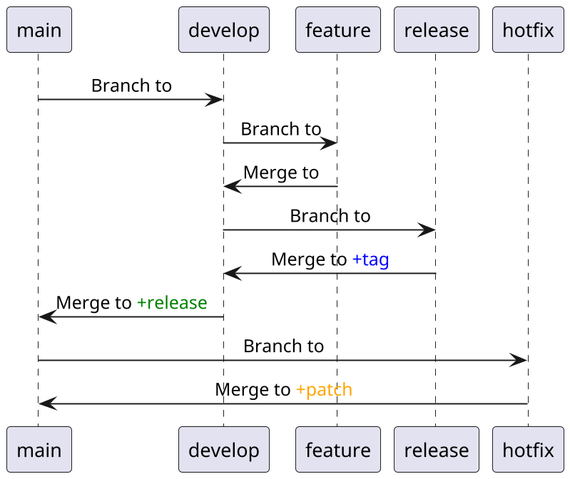

# Git branching strategy
The primary git [branching](https://en.wikipedia.org/wiki/Branching_(version_control)) strategy should be GitFlow. See more information in this document below and refer existing repositories branching. If there is a strong need to chose a different strategy, it's allowed, but consult with the team leader or CTO. If there is no need to follow [semantic versioning](https://en.wikipedia.org/wiki/Software_versioning) and there is no need to categorize the progress of a certain repository in different stages, then this strategy can be skipped.

---

## Contents
- [Introduction](#git-branching-strategy)
- [Abstract](#abstract)
- [Note](#note)

---

## Abstract
In terms of `+tag`, `+release`, `+patch` and any other versioning action follow [sematic versioning](https://en.wikipedia.org/wiki/Software_versioning) and the repository version naming conventions.

## Note
If the document's diagrams are not visible, [planUML](https://plantuml.com/) server should be configured and/or showing insecure content in your IDE should be allowed.

#knowledge-base